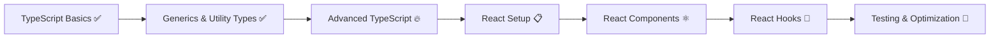

# 📚 **Learning Guide - Todo App**

## 📁 **Documentation Structure**

Tài liệu học tập đã được tổ chức thành các file riêng biệt để dễ theo dõi và quản lý:

### **📋 Current Files:**

| File                             | Purpose                        | Status                |
| -------------------------------- | ------------------------------ | --------------------- |
| `typescript-learning-roadmap.md` | 🎯 TypeScript learning journey | ✅ **In Progress**    |
| `react-learning-roadmap.md`      | ⚛️ React migration roadmap     | 📋 **Ready to Start** |
| `LEARNING-GUIDE.md`              | 📚 This overview document      | ✅ **Active**         |

---

## 🎯 **Learning Journey Overview**

### **Phase 1: TypeScript Mastery** ✅ **Advanced Level**

**Achievements:**

- ✅ **Generics Excellence** - Repository pattern with `<T extends { id: string }>`
- ✅ **EventEmitter Generic** - Type-safe event system
- ✅ **Utility Types** - `Partial<T>`, `Omit<T>`, advanced typing
- ✅ **Repository Pattern** - Clean data layer with UUID integration

**Current Focus:**

- 🔥 Conditional Types & Template Literals
- 🎯 Advanced Design Patterns
- 📈 Performance Optimization

**Progress:** `typescript-learning-roadmap.md`

---

### **Phase 2: React Migration** 🚀 **Ready to Begin**

**Migration Strategy:**

- 📦 Keep existing Repository & Generic patterns
- 🔄 Replace EventEmitter with React Context
- ⚛️ Convert DOM manipulation to React components
- 🎣 Implement custom hooks for business logic

**Roadmap:** `react-learning-roadmap.md`

---

## 🛣️ **Recommended Learning Path**

### **Current State: TypeScript Advanced → React Ready**



### **Next Steps:**

1. **Complete TypeScript Advanced Features** (Optional)

   - Conditional types, template literals
   - Advanced design patterns

2. **Begin React Migration** (Recommended)
   - Start with `react-learning-roadmap.md`
   - Apply TypeScript skills to React development

---

## 📊 **Progress Tracking**

### **TypeScript Journey:**

| Topic             | Status           | Notes                             |
| ----------------- | ---------------- | --------------------------------- |
| Basic Syntax      | ✅ Complete      | Interfaces, types, classes        |
| Generics          | ✅ **Excellent** | Repository, EventEmitter patterns |
| Utility Types     | ✅ Complete      | Partial, Omit, advanced usage     |
| Advanced Features | ⏳ Ready         | Conditional types next            |

### **React Journey:**

| Phase            | Status     | Checkpoint                |
| ---------------- | ---------- | ------------------------- |
| Setup            | 📋 Planned | React + TypeScript config |
| State Management | 📋 Planned | Context + useReducer      |
| Components       | 📋 Planned | Typed React components    |
| Testing          | 📋 Planned | React Testing Library     |

---

## 🎯 **Learning Objectives**

### **Short-term (Next 2 weeks):**

- [ ] Complete React setup and basic components
- [ ] Migrate TodoStore to React Context
- [ ] Implement first React components with TypeScript

### **Medium-term (Next month):**

- [ ] Complete React migration with full feature parity
- [ ] Add comprehensive testing
- [ ] Implement advanced React patterns

### **Long-term (Next 2-3 months):**

- [ ] Master React + TypeScript best practices
- [ ] Build production-ready application
- [ ] Contribute to open source projects

---

## 🚀 **Quick Start Guide**

### **To Continue TypeScript Learning:**

```bash
# Open TypeScript roadmap
code typescript-learning-roadmap.md

# Focus on advanced features (conditional types, etc.)
```

### **To Start React Migration:**

```bash
# Open React roadmap
code react-learning-roadmap.md

# Install React dependencies
npm install react react-dom @types/react @types/react-dom
```

---

## 🏆 **Achievements Unlocked**

### **TypeScript Mastery:**

- 🎯 **Generic Repository Pattern** - Professional-grade implementation
- ⚡ **EventEmitter System** - Type-safe event handling
- 🔧 **Utility Types Expert** - Advanced type manipulation
- 🏗️ **Clean Architecture** - Repository, Storage patterns

### **Ready for React:**

- ✅ **Strong TypeScript Foundation**
- ✅ **Component Architecture Understanding**
- ✅ **Event-driven Pattern Experience**
- ✅ **Type-safe Development Mindset**

---

## 📞 **How to Use This Guide**

1. **Check Progress** - Review current achievements in relevant roadmap
2. **Choose Path** - TypeScript advanced features OR React migration
3. **Follow Roadmap** - Use detailed roadmaps for step-by-step guidance
4. **Track Progress** - Update checkboxes and notes as you learn

---

**🎉 Congratulations on your TypeScript journey so far! You're ready for the next challenge! 🚀**

**Choose your adventure:**

- 📈 **Level up TypeScript** → `typescript-learning-roadmap.md`
- ⚛️ **Begin React journey** → `react-learning-roadmap.md`
